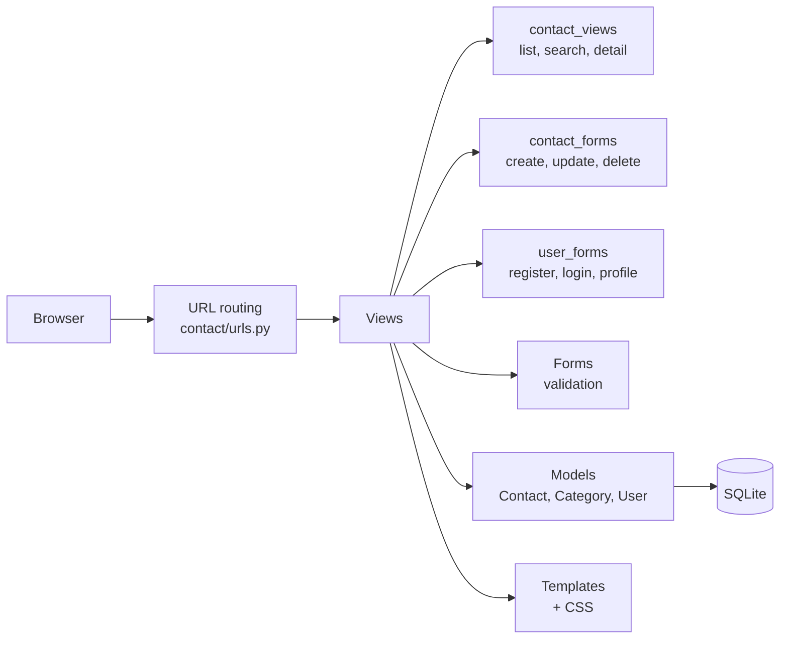
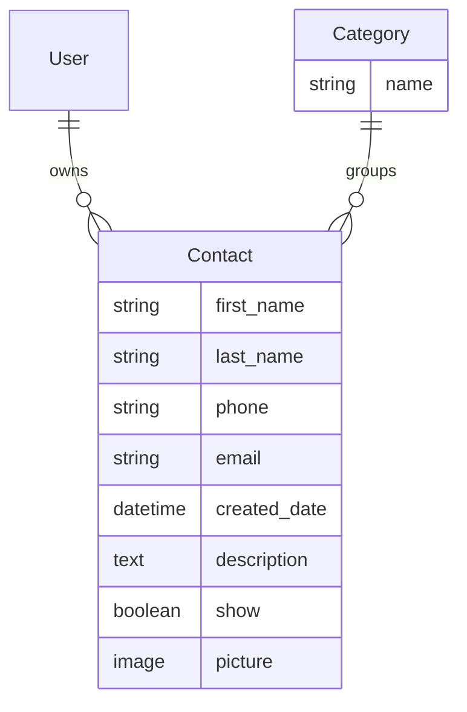

# Agenda: Contact Manager


A full-stack contact book web application built with Django. Users create an account, then add, edit and delete contacts with photos and categories. The app includes search, pagination and an administration panel.

Built as a course project to practise Django end to end: models and migrations, forms and validation, authentication, file uploads and templates.

---

## Features

**Contacts**
- Create, view, update and delete contacts (name, phone, email, description)
- Profile picture upload, stored by year and month
- Categories such as friends, family and acquaintances
- Visibility flag to hide a contact without deleting it

**Users**
- Registration with password validation and duplicate email checks
- Login, logout and profile editing
- Ownership: contacts are linked to the user who created them, and only that user can edit or delete them

**Browsing**
- Search by first name, last name, phone or email
- Pagination, 10 contacts per page

**Administration**
- Django admin panel to manage contacts and categories, with filters and inline editing

---

## Architecture



### Data model



Deleting a user or category keeps their contacts and sets the link to empty (`on_delete=SET_NULL`), so no contact data is lost by accident.

### Routes

| URL | Purpose | Login required |
|---|---|---|
| `/` | Contact list | No |
| `/search/?q=` | Search contacts | No |
| `/contact/<id>/` | Contact details | No |
| `/contact/create/` | New contact | Yes |
| `/contact/<id>/update/` | Edit contact | Yes, owner only |
| `/contact/<id>/delete/` | Delete contact, with confirmation | Yes, owner only |
| `/user/create/` | Register | No |
| `/user/login/` · `/user/logout/` | Sign in and out | — |
| `/user/update/` | Edit profile | Yes |
| `/admin/` | Admin panel | Staff only |

---

## Getting started

### Prerequisites

- Python 3.10+

### Installation

```bash
git clone https://github.com/JRBaiao/Project-Agenda.git
cd Project-Agenda

python -m venv venv
source venv/bin/activate        # Windows: venv\Scripts\activate
pip install -r requirements.txt
```

### Set up the database

```bash
python manage.py migrate
python manage.py createsuperuser    # account for the admin panel
```

### Optional: add sample data

```bash
python utils/create_contacts.py
```

This generates 1,000 realistic fake contacts with [Faker](https://faker.readthedocs.io/) in three categories. **It deletes all existing contacts and categories first**, so only use it on a test database. Sample contacts have no owner, so they can only be edited through the admin panel.

### Run

```bash
python manage.py runserver
```

Open **http://127.0.0.1:8000**. The admin panel is at **http://127.0.0.1:8000/admin**.

---

## Project structure

```
├── manage.py
├── project/                  # Django settings and root URL configuration
├── contact/                  # Main application
│   ├── models.py             # Contact and Category models
│   ├── forms.py              # Contact, registration and profile forms
│   ├── views/                # Views split by responsibility
│   ├── templates/contact/    # Page templates
│   ├── migrations/           # Database schema history
│   └── admin.py              # Admin panel configuration
├── base_templates/global/    # Shared layout, header and pagination
├── base_static/global/css/   # Stylesheet
├── utils/create_contacts.py  # Sample data generator
└── requirements.txt
```

---

## Limitations and next steps

This is a development project and is not configured for deployment:

- **Contacts are visible to everyone.** The list, search and detail pages show all contacts to any visitor, including people who aren't logged in; only editing and deleting are restricted to the owner. For an address book, which holds personal data, the next step is to show each user only their own contacts.
- **Development settings.** The secret key is stored in `settings.py` and debug mode is on. Production use requires loading secrets from environment variables, turning debug off and setting allowed hosts.
- **Mixed languages.** Some interface messages and sample data are in Portuguese.
- **No automated tests** yet.

Other ideas: export contacts to CSV, a dedicated category filter, and deployment with PostgreSQL.
